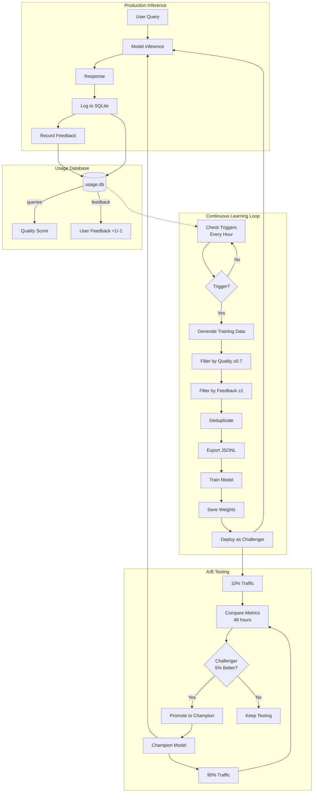
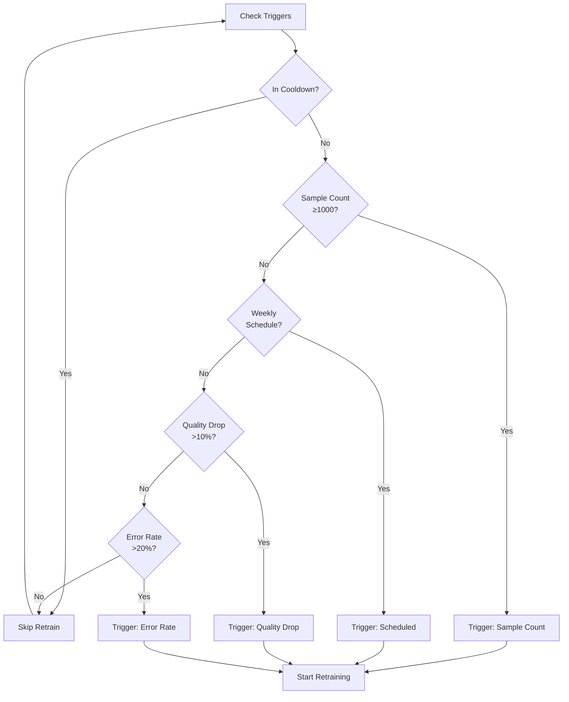
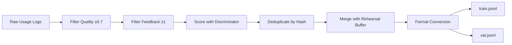
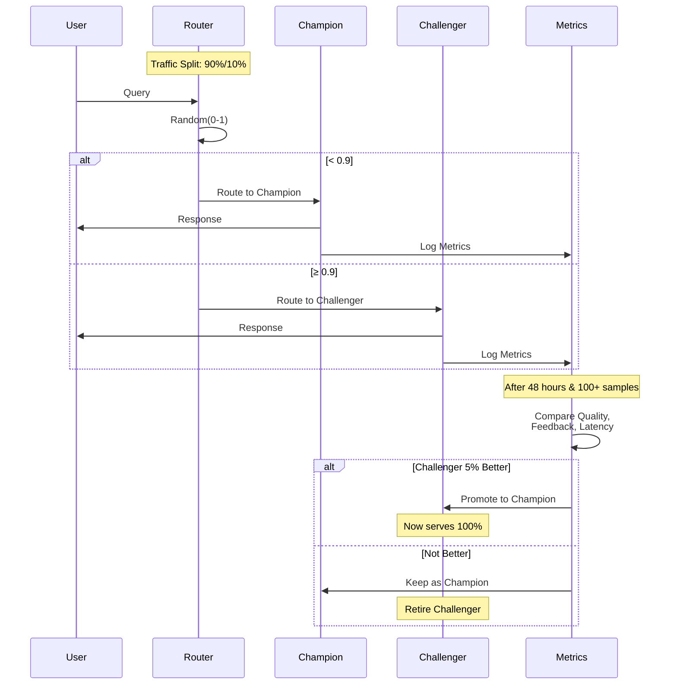
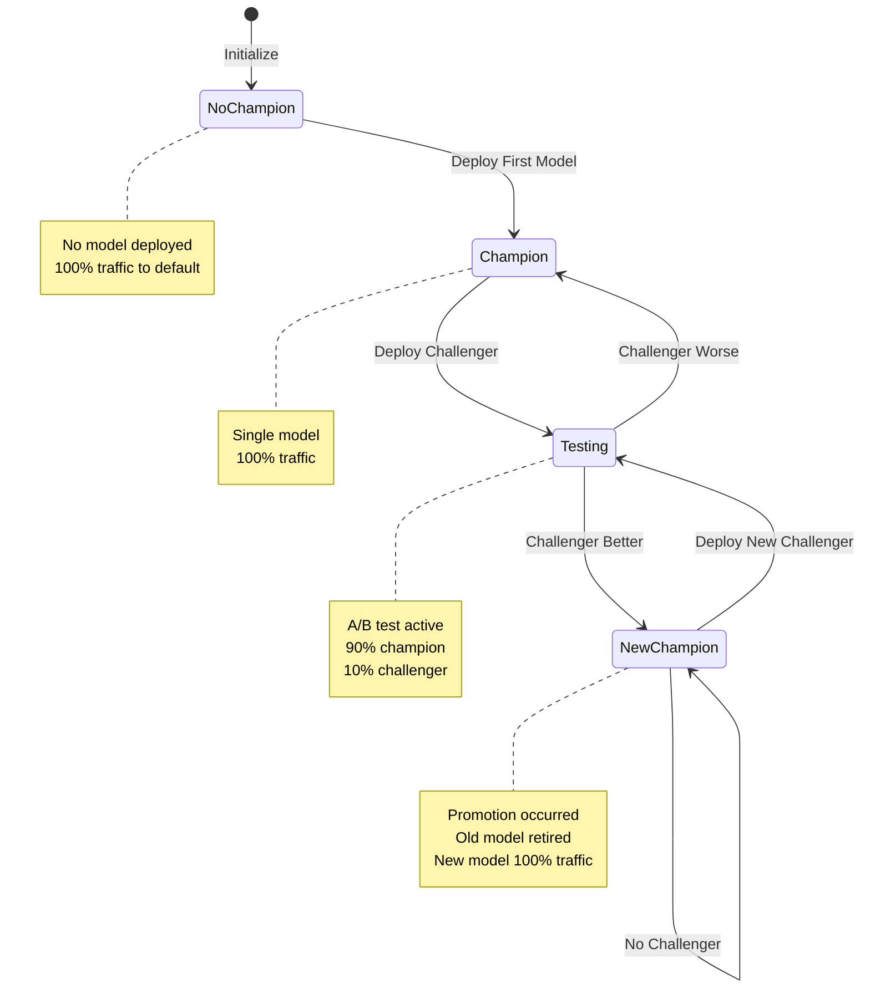
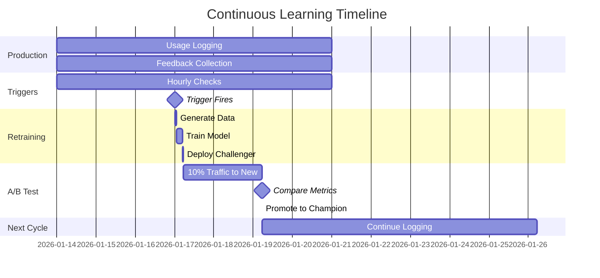
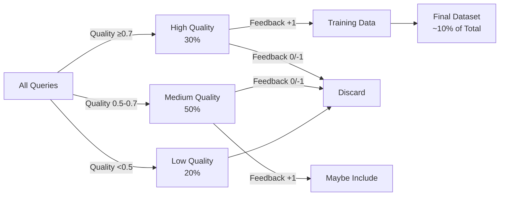
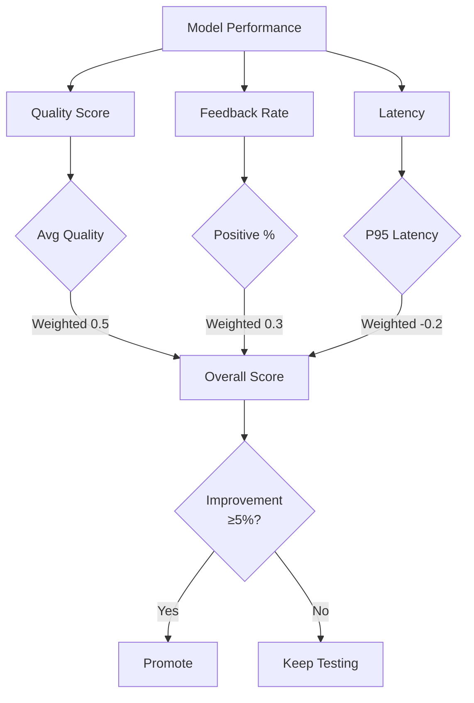

# Continuous Learning System Flow

## System Architecture



## Trigger Decision Flow



## Data Generation Pipeline



## A/B Testing Flow



## Component Interaction

```mermaid
graph TB
    subgraph "UsageLogger"
        A1[log()] --> A2[SQLite Insert]
        A3[record_feedback()] --> A2
        A4[get_records()] --> A5[Query + Filter]
    end

    subgraph "TrainingDataGenerator"
        B1[generate()] --> B2[Collect Candidates]
        B2 --> B3[Score Quality]
        B3 --> B4[Filter + Dedupe]
        B4 --> B5[Export JSONL]
    end

    subgraph "RetrainTrigger"
        C1[check_triggers()] --> C2[Sample Count?]
        C1 --> C3[Schedule?]
        C1 --> C4[Quality Drop?]
        C1 --> C5[Error Rate?]
        C2 --> C6[TriggerResult]
        C3 --> C6
        C4 --> C6
        C5 --> C6
    end

    subgraph "ABTestManager"
        D1[deploy_challenger()] --> D2[Set Traffic Split]
        D3[route_request()] --> D4[Random Selection]
        D5[compare_models()] --> D6[Compute Improvement]
        D6 --> D7[Winner?]
        D8[auto_promote()] --> D9[Promote Challenger]
    end

    subgraph "ContinuousLearningLoop"
        E1[run_iteration()] --> E2[Check Triggers]
        E2 --> E3[Generate Data]
        E3 --> E4[Train Model]
        E4 --> E5[Deploy Challenger]
        E5 --> E6[Compare & Promote]
    end

    A2 --> B2
    A5 --> C1
    C6 --> B1
    B5 --> E4
    D7 --> D8
    E2 --> C1
    E3 --> B1
    E5 --> D1
    E6 --> D5
```

## State Transitions



## Time-Based Flow



## Quality Score Distribution



## Performance Metrics


